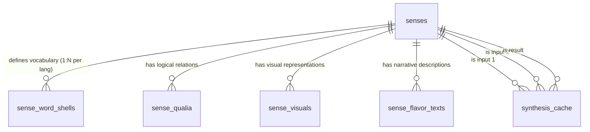

# Backend Data Schema Documentation

## Overview
This document outlines the full database schema for the `public` schema in the Supabase backend. The database is designed to support the **SenseEntity** concept system, handling multi-lingual semantic data, AI generation caching, and rich media assets.

**Project ID**: `leehstoygnmmofpznsvc`
**Extensions**: `vector`, `postgis`, `pg_graphql`, `pgcrypto`, `pgsodium`, `pg_trgm`, `fuzzystrmatch`, `ltree`, `hstore`.

---

## 1. Core Tables

### `public.senses`
The central registry of all concepts (Senses).
| Column | Type | Default | Description |
| :--- | :--- | :--- | :--- |
| **`uid`** | `uuid` | `uuid_generate_v4()` | **PK**. Unique identifier for the concept. |
| `fingerprint` | `jsonb` | - | 6 precise English Anchor Words (Tier 1/2/3) for fuzzy matching. |
| `ontology` | `jsonb` | - | Hypernym category (OBJECT, PROCESS, etc.) stored as `{ value: "OBJECT", meta: {...} }`. |
| `frequency` | `jsonb` | `{'value': 0...}` | Usage frequency/popularity score. |
| **`frequency_val`** | `integer` | *Generated* | **Stored Column**. Extracted integer value from `frequency` for efficient sorting. |
| `meaning` | `jsonb` | `'{}'` | Dictionary of definitions by language. |
| `search_vector` | `tsvector` | - | Full-text search vector. |

**Indexes:**
- `idx_senses_frequency` (on `frequency_val`)
- `idx_senses_ontology` (GIN on `ontology`)

---

### `public.sense_word_shells`
Maps concepts to natural language words. **One row per language per sense.**
| Column | Type | Default | Description |
| :--- | :--- | :--- | :--- |
| `id` | `bigint` | `nextval(...)` | **PK**. Internal ID. |
| **`sense_id`** | `uuid` | - | **FK** -> `senses.uid`. |
| **`lang`** | `text` | - | Language code (e.g., 'en', 'zh-CN'). **Unique per Sense**. |
| `shells` | `jsonb` | `'[]'` | Array of `WordShell` objects (max 20). Contains `text`, `pos`, `level`, `nuances`, etc. |

**Constraints:**
- `idx_sense_word_shells_lang`: UNIQUE `(sense_id, lang)` ensures strict language separation.

---

### `public.sense_qualia`
Stores logical relationships based on Pustejovsky’s Qualia Structure.
| Column | Type | Default | Description |
| :--- | :--- | :--- | :--- |
| `id` | `bigint` | `nextval(...)` | **PK**. |
| **`sense_id`** | `uuid` | - | **FK** -> `senses.uid`. |
| `slot` | `qualia_slot` | - | Enum: `formal`, `constitutive`, `telic`, `agentive`. |
| `lang` | `language_code` | - | Enum: `en`, `zh-CN`, `fr`, etc. |
| `items` | `jsonb` | `'[]'` | Array of qualia entries (max 20) with text and fingerprints. |

---

### `public.sense_visuals`
Stores renderable assets (SVG animations) for the concept.
| Column | Type | Default | Description |
| :--- | :--- | :--- | :--- |
| `id` | `bigint` | `nextval(...)` | **PK**. |
| **`sense_id`** | `uuid` | - | **FK** -> `senses.uid`. |
| `visual_id` | `text` | - | Identifier for the visual variant (e.g., "default", "magic_state"). |
| `svg` | `text` | - | Raw SVG content string. |
| `meta` | `jsonb` | - | Metadata for rendering (viewBox, animation params). |

---

### `public.sense_flavor_texts`
Stores narrative descriptions and AI persona-driven content.
| Column | Type | Default | Description |
| :--- | :--- | :--- | :--- |
| `id` | `bigint` | `nextval(...)` | **PK**. |
| **`sense_id`** | `uuid` | - | **FK** -> `senses.uid`. |
| `persona` | `text` | - | AI Persona ID (e.g., "The Joker", "The Prophet"). |
| `translations` | `jsonb` | `'{}'` | Map of `Language -> { text, example }`. |
| `global_meta` | `jsonb` | - | Metadata valid across all languages. |

---

### `public.synthesis_cache`
Caches AI generation results to prevent redundant API calls.
| Column | Type | Default | Description |
| :--- | :--- | :--- | :--- |
| `id` | `bigint` | `nextval(...)` | **PK**. |
| **`sense_uid_1`** | `uuid` | - | **FK**. First input sense. |
| **`sense_uid_2`** | `uuid` | - | **FK**. Second input sense. |
| **`result_sense_uid`** | `uuid` | - | **FK**. The generated output sense. |
| `method_id` | `integer` | - | Synthesis method (1-6). |
| `slot_index` | `integer` | - | Slot configuration (1-2). |
| `word_text_a` | `text` | - | Text of first input word (snapshot). |
| `word_text_b` | `text` | - | Text of second input word (snapshot). |
| `lang` | `text` | - | Language of the synthesis context. |

**Indexes:**
- `idx_synthesis_cache_inputs`: `(sense_uid_1, sense_uid_2)` unique lookup.
- `idx_synthesis_cache_result`: Reverse lookup.

---

## 2. Relationships Diagram

