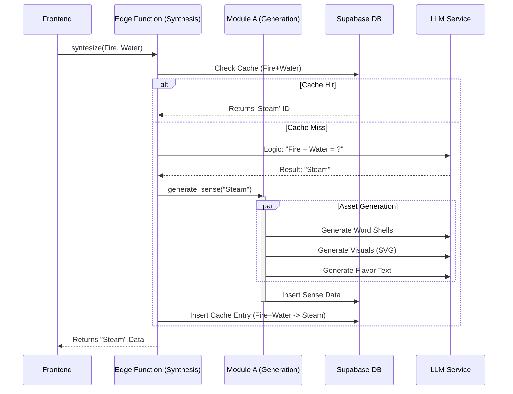

# Synthesis Data Flow Architecture

> **Status**: Refined / Implementation Phase
> **Date**: 2026-02-16

This document outlines the architecture for the "Card Synthesis" feature, connecting the frontend to the Supabase backend and AI services.

## 1. Core Architecture: Decoupled Logic

We separate the system into two distinct modular functions.
**Function B (Synthesis)** determines *what* the new concept is, and **Function A (Generation)** determines *how* it is represented (data, visuals, flavor).

### Module A: `generate_sense_data(concept, language_context)`
*   **Goal**: Create a full Sense record from a core concept definition, tailored to a specific cultural context.
*   **Input**: 
    *   `concept_name`: "Steam" (String)
    *   `language_context`: "zh-CN" (String)
*   **Normalization**: `concept_name` is **lowercased** and **trimmed** before any DB check to ensure Case-Insensitivity (e.g., "Steam" == "steam").
*   **Actions**:
    1.  **Word Shells**: Generate definitions, nuances, and POS in the `language_context` first, then English.
    2.  **Visuals**: Generate SVG rendering and metaphor.
    3.  **Flavor Text**: Generate persona-based descriptions relevant to the `language_context` (e.g., using a Chinese idiom for Steam if applicable).
*   **Output**: A fully populated `senses` row.
*   **Note**: `sense_qualia` is explicitly excluded for this phase.

### Module B: `synthesize_concepts(input_1, input_2, language_context)`
*   **Goal**: Determine the result of combining two existing Senses *within a specific cultural framework*.
*   **Input**: 
    *   `input_1`: UUID
    *   `input_2`: UUID
    *   `language_context`: "zh-CN" (String) - **CRITICAL**
*   **Actions**:
    1.  **Cache Check**: Check `synthesis_cache` for `(input_1, input_2)`. 
        *   *Note*: The synthesis result is considered universal (Fire + Water = Steam) regardless of language.
    2.  **AI Logic**: Ask LLM: "In the context of [Learning Language], what is the alchemical result of [Input 1] + [Input 2]?"
    3.  **Call Module A**: Pass the result to **Module A** with the `language_context`.
    4.  **Cache Save**: Store the mapping `(Input 1, Input 2) -> Result ID`.
*   **Output**: The resulting Sense ID.

## 2. Architecture Diagram

## 3. Detailed Data Flow

### Step 1: Frontend Initiation
The user drags two cards together.
*   **Payload**: `{ "input_1_id": "uuid", "input_2_id": "uuid", "lang": "zh-CN" }`
*   **Endpoint**: `supabase.functions.invoke('synthesize-sense')`

### Step 2: The Synthesis Logic (Module B)
This is the entry point. It prioritizes speed via caching.
1.  **Normalize**: Sort input IDs alphabetically.
2.  **Lookup**: Query `public.synthesis_cache` matching `(id1, id2)`. 
    *   *Note*: Cache is language-agnostic.
3.  **Decision**: If no cache, asks the AI for the *Concept* using the cultural context to seed the generation.

### Step 3: The Generation Logic (Module A)
This is the heavy lifter. It runs only when a *new* concept is discovered.
*   **Normalization**: Check `senses` table for existing concept name (LOWERCASE check).
*   **Parallel Execution**: Visuals, Text, and Shells can be generated in parallel promises.
*   **Atomic Write**: All `sense_*` tables are updated in a single transaction if possible.

### Step 4: Response
The Edge Function returns the full object to the client, allowing immediate rendering of the new card.

## 4. Database Schema Impact

### Required Tables (Verified)
*   `senses` (Core ID)
*   `sense_word_shells` (Language data)
*   `sense_visuals` (SVG assets)
*   `sense_flavor_texts` (Narrative)
*   `synthesis_cache` (The memory)
    *   **Optimization**: Ensure `(sense_uid_1, sense_uid_2)` is a composite unique index for fast lookups.

### Future Considerations
*   `sense_qualia`: Currently skipped. Will be added to **Module A** in future iterations.

## 5. Benefits of Nesting
1.  **Reusability**: **Module A** can be used for administrative tools ("Admin creates a new card manually") or other game mechanics ("Random loot drop generation") without needing a synthesis pair.
2.  **Maintainability**: Prompt engineering for "Visuals" is separated from "Alchemical Logic".
