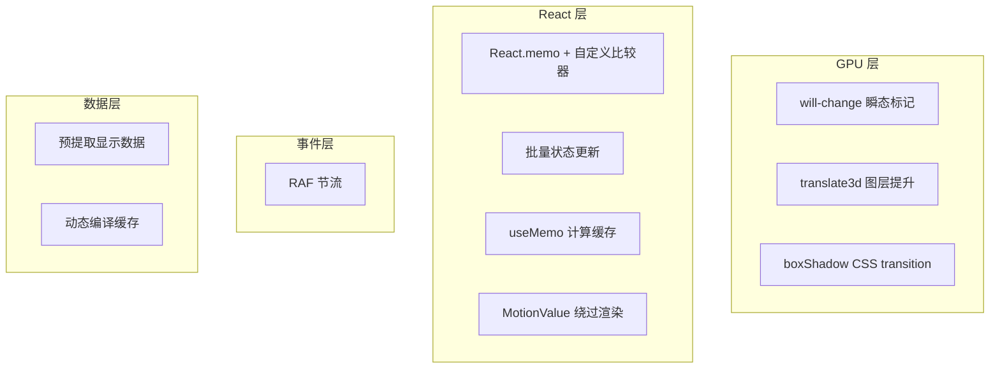

# Lexicoin 性能优化策略说明

本文档梳理了 Lexicoin 项目中采用的所有性能优化策略，按作用层级分类。

---

## 1. GPU 合成层管理

### 1.1 `will-change` 瞬态标记（Transient Animation Flag）

**位置**: `Card.tsx`

卡片在放大状态下需要保持文本清晰（避免 GPU 栅格化导致的亚像素模糊），但翻转/缩放动画期间又需要 GPU 合成层加速。

**策略**: 使用 `isAnimating` 瞬态标记，仅在动画过渡期（~600ms）开启 `will-change: transform`，动画结束后自动关闭。

```tsx
// 右键翻转时启动
setIsAnimating(true);
animatingTimerRef.current = setTimeout(() => setIsAnimating(false), 600);

// will-change 条件：仅在拖拽、动画中、或画布缩小时启用
willChange: (isDragging || isAnimating || (!isExpanded && canvasScale < 1))
  ? 'transform' : 'auto'
```

**权衡**: `will-change: transform` 会创建独立合成层，有利于动画性能但会导致文本模糊。通过瞬态标记在**动画平滑**与**静态清晰**之间取得平衡。

### 1.2 `translate3d(0,0,0)` 强制图层提升

**位置**: `Card.tsx`

```tsx
transform: 'translate3d(0, 0, 0)'
```

强制浏览器为卡片创建独立的 GPU 合成层，避免与画布其他元素共享图层导致的重绘扩散。

> **注意**: Motion (framer-motion) 在更新 `style.x/y/rotateX` 时会覆盖 CSS `transform`，因此该提示在 Motion 动画期间可能不生效。其主要作用是在**非动画状态**下保持图层隔离。

---

## 2. 动画性能

### 2.1 `boxShadow` CSS Transition 替代逐帧插值

**位置**: `Card.tsx`

`boxShadow` 无法被 GPU 合成（每帧触发 repaint），如果放在 Motion 的 `animate` 属性中会逐帧插值，开销极大。

**策略**: 将 `boxShadow` 移到 `style` + CSS `transition`：

```tsx
// style 中声明
boxShadow: targetShadow,
transition: 'box-shadow 0.3s ease-out',

// animate 中仅保留可 GPU 合成的属性
animate={{ scale: targetScale }}
```

### 2.2 弹簧动画参数配置

**位置**: `Card.persona.default.tsx`

```tsx
springs: {
  smoothVelocity: { damping: 40, stiffness: 150, mass: 0.8 },
  scale:          { stiffness: 200, damping: 25, mass: 0.8 },
  flip:           { stiffness: 150, damping: 20 },
  mouseTilt:      { damping: 50, stiffness: 120, mass: 1 },
}
```

所有动画参数通过 Persona 系统集中管理，便于调校。

---

## 3. React 渲染优化

### 3.1 `React.memo` 记忆化

以下组件使用 `React.memo` 避免不必要的 re-render：

| 组件 | 位置 | 比较策略 |
|------|------|----------|
| `CardVisual` | `CardVisual.tsx` | 默认浅比较 |
| `MemoizedCardVisual` | `CardVisual.tsx` | 自定义比较器（仅比较 `isCompact`, `visualPayload`, `isActive`, `fallbackWord`, `durability`, `bgParallaxX/Y`） |
| `VisualFeedbackOverlay` | `CardVisual.tsx` | 默认浅比较 |
| Persona 视觉组件 | `Card.persona.default.tsx` | 默认浅比较（`HermeticBackground`, `AlchemicalCorners`, `CrucibleFrame` 等 7 个组件） |

### 3.2 批量状态更新（Batched State Update）

**位置**: `Card.tsx` — `onContextMenu`

```tsx
// React 18 自动合并为一次渲染
setIsFlipped(true);
setIsExpanded(true);
```

### 3.3 `useMemo` 计算缓存

| 位置 | 缓存对象 | 依赖项 |
|------|----------|--------|
| `DynamicVisual.tsx` | sucrase 编译结果（`loadDynamicComponent`） | `[code]` |
| `Card.tsx` | `selectionItems` | `[sortedVariants, learningLanguage]` |
| `CardVisual.tsx` | `availablePersonas`, `currentFlavorContents` | `[flavorContents]` |

---

## 4. 事件处理优化

### 4.1 RAF 节流（Canvas 滚轮缩放）

**位置**: `Canvas.tsx`

```tsx
// 存储最新事件，用 RAF 合并处理
pendingWheelEvent.current = { delta: dy, event };
if (rafThrottle.current !== null) return; // 跳过中间帧
rafThrottle.current = requestAnimationFrame(() => { ... });
```

将高频 wheel 事件合并到每帧最多执行一次，避免缩放抖动。

### 4.2 MotionValue 绕过 React 渲染

**位置**: `Card.tsx`

卡片位置 `x`/`y` 使用 Motion 的 `MotionValue` 而非 React state，拖拽时通过 `x.set()` / `y.set()` 直接更新 DOM，**绕过 React 的 diff/render 周期**。

```tsx
// 拖拽更新 —— 不触发 React re-render
x.set(finalX);
y.set(finalY);
```

---

## 5. 运行时代码管理

### 5.1 动态组件编译缓存

**位置**: `DynamicVisual.tsx` + `dynamicComponentLoader.ts`

AI 生成的 TSX 视觉组件在运行时通过 sucrase 编译，结果用 `useMemo` 缓存：

```tsx
const Component = useMemo(() => {
  if (!code) return null;
  return loadDynamicComponent(code); // sucrase 同步编译
}, [code]);
```

> **已知局限**: 编译是同步阻塞主线程的。如果组件代码较大，首次编译可能造成短暂卡顿。未来可考虑 Web Worker 异步编译。

---

## 6. 数据管道优化

### 6.1 预提取显示数据（Pre-extracted Display Data）

**位置**: `senseToCard.ts` → `CardEntity`

卡片创建时即从 `SenseEntity` 中提取并扁平化所有显示数据（`word`, `definition`, `flavorContents` 等），避免渲染时的深层属性访问和运算。

```
SenseEntity (原始语义数据)
    ↓ sensesToCards() —— 一次性提取
CardEntity.displayData[language] (扁平化的渲染就绪数据)
```

---

## 优化策略总览


