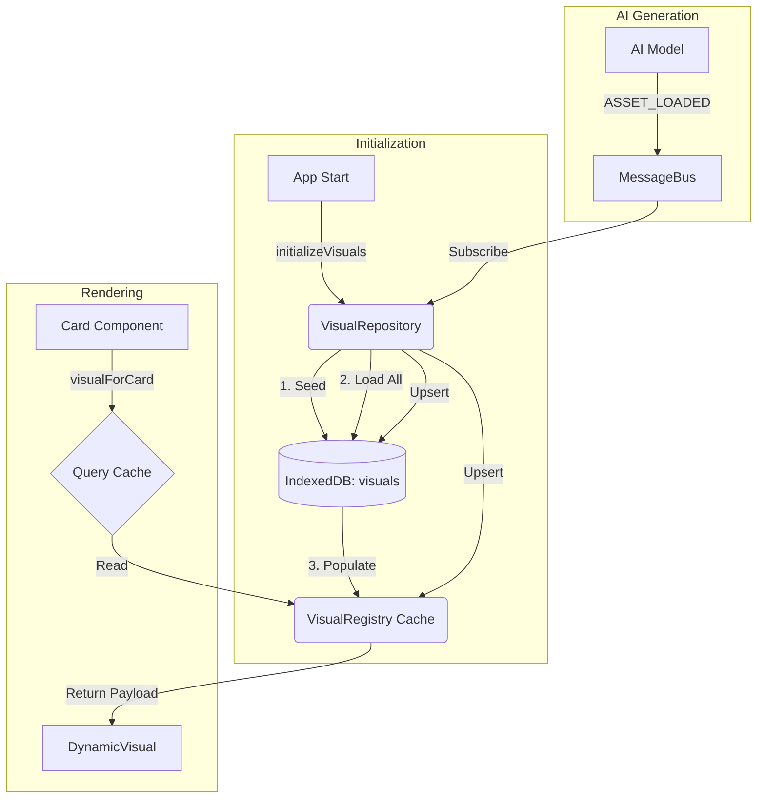

# Visual Pipeline System (IndexedDB Architecture)

## Overview
The Visual Pipeline is responsible for identifying, extracting, and rendering dynamic visual content (usually React components with SVG animations) for specific `SenseEntities`.

**Key Change:** The pipeline now uses **IndexedDB (Dexie.js)** as the source of truth for visual payloads, with an in-memory **synchronized cache (VisualRegistry)** for performance.

## Core Architecture

### 1. Data Source: IndexedDB (`lexicoin_db`)
- **Table**: `visuals` (Compound Key: `[uid+variantId]`)
- **Type**: `VisualRecord { uid: string, variantId: string, data: VisualEntry }`
- **Role**: Persistent storage for all visual payloads (including AI-generated ones).

### 2. Repository Layer: `VisualRepository`
- **File**: `src/core/storage/VisualRepository.ts`
- **Role**: Handles all read/write operations to IndexedDB.
- **Methods**:
    - `seed(entries)`: Populates initial visuals (from `InitialItem/index.ts`).
    - `loadAllIntoRegistry()`: Syncs all DB records into the in-memory Registry.
    - `upsert(entry)`: Dual-write > Saves to DB **AND** registers in Registry.
    - `initSubscriptions()`: Listens to `ASSET_LOADED` for AI updates.

### 3. In-Memory Cache: `VisualRegistry` (Sync)
- **File**: `src/core/registries/VisualRegistry.ts`
- **Role**: Singleton Map for **synchronous, O(1)** lookups during render.
- **Logic**: Updated exclusively by `VisualRepository`. Not intended for direct write access by other modules.

### 4. Initialization Pipeline
- **File**: `src/core/init/initializeVisuals.ts`
- **Flow** (Async):
    1.  `VisualRepository.seed()`
    2.  `VisualRepository.loadAllIntoRegistry()`
    3.  `VisualRepository.initSubscriptions()`
- **Result**: Visuals are ready in-memory before the first card render.

### 5. Extraction Pipeline: `visualForCard.ts`
- **Logic**: Queries the in-memory `VisualRegistry` (unchanged).
    - If found -> `status: 'loaded'` + payload.
    - Else -> `status: 'loading'`.

### 6. Dynamic Rendering: `DynamicVisual`
- **File**: `src/app/utils/dynamicComponentLoader.ts`
- **Role**: Compiles the TSX string payload at runtime using `sucrase`.
- **Component**: `DynamicVisual.tsx` performs the rendering.

## Dependency Strategy
We enforce a **Dual-Alias Strategy** (framer-motion / motion/react) to ensure compatibility with both older AI models and modern libraries. See `dynamicComponentLoader.ts` for the scope definition.

## Data Flow Diagram

## Adding New Visuals
1.  **Static**: Add to `schemas/data/InitialItem/`, update `InitialItem/index.ts` export.
2.  **Dynamic/AI**: Send `ASSET_LOADED` message with `VisualEntry` payload. The system handles persistence automatically.
