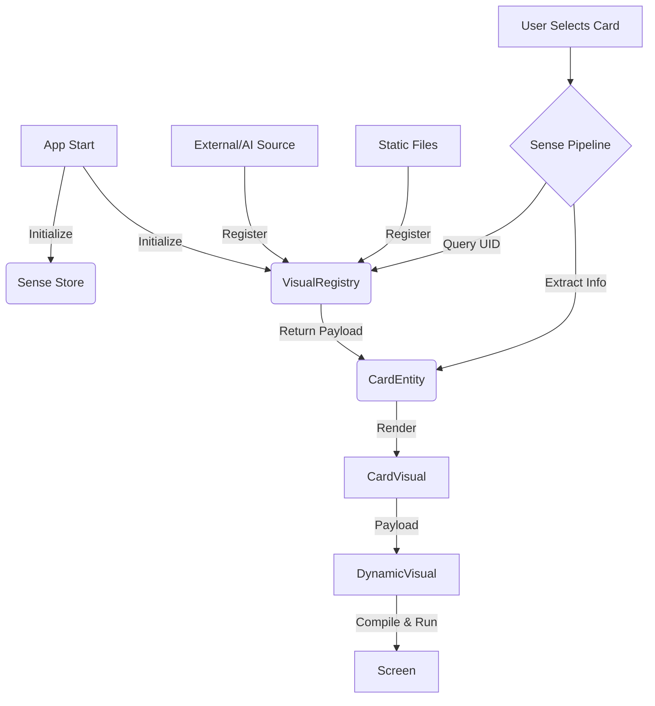

# Visual Pipeline System

## Overview
The Visual Pipeline is responsible for identifying, extracting, and rendering dynamic visual content (usually React components with SVG animations) for specific `SenseEntities`. It follows a **Registry Pattern**, decoupling the semantic data from the visual presentation.

## Core Architecture

### 1. The Registry (Source of Truth)
- **File**: `src/core/registries/VisualRegistry.ts`
- **Role**: A singleton that stores all available visual payloads.
- **Key**: `UID` (e.g., `SENSE_ALCHEMICAL_FIRE_002`)
- **Key (Variant)**: `id` (e.g., `default`, `highlighted`)
- **Value**: `VisualEntry` (containing the code payload)

### 2. The Initialization
- **File**: `src/core/init/initializeVisuals.ts`
- **Role**: Bootstraps the registry with initial static visuals at application startup.
- **Hook**: Called by `moduleInit.ts` during the app launch sequence.

### 3. The Extraction Pipeline
- **File**: `src/pipelines/visualForCard.ts`
- **Role**: Queries the Registry for a visual matching the Sense UID.
- **Logic**:
    1. Check Registry for `Sense.uid`.
    2. If found, return `status: 'loaded'` and the payload.
    3. If not found, return `status: 'loading'`.

### 4. The Rendering Engine
- **File**: `src/app/utils/dynamicComponentLoader.ts`
- **Role**: Compiles the TSX string payload at runtime using `sucrase`.
- **Component**: `DynamicVisual.tsx` performs the rendering and handles errors/fallbacks.

## Dependency Strategy (Robust Aliasing)

To ensure stability across different AI models and library versions, we implement a **Dual-Alias Strategy** for animation libraries.

### Problem
- Older AI models and existing codebases often use `framer-motion` (v10/v11).
- The latest standard is `motion/react` (v12+).
- Dynamic runtime compilation (via `sucrase`) can sometimes struggle with deep path resolution (like `motion/react`) depending on the environment shim.

### Solution
We enforce a robust runtime environment in `dynamicComponentLoader.ts`:

1.  **Scope Aliasing**: We map **both** `framer-motion` and `motion/react` import keys to the *same* underlying installed library (`motion` v12+).
    ```typescript
    const SCOPE = {
        react: React,
        'motion/react': Motion,    // Future-proof standard
        'framer-motion': Motion,   // AI Compatibility Alias
    };
    ```

2.  **Conservative Generation**: When generating new visual payloads (via AI or manual coding), prefer importing from `framer-motion`. This is the most widely recognized token and avoids potential path resolution issues in the lightweight runtime compiler.

## Data Flow Diagram



## Usage Guide

### Registering a New Visual (Manual/Static)
1.  Define your visual file (e.g., `MyVisual.ts`) exporting a `VisualEntry` with the code payload.
2.  Import it in `src/core/init/initializeVisuals.ts`.
3.  Call `visualRegistry.register(MY_VISUAL)`.

### Registering a Dynamic Visual (AI/Runtime)
Simply access the registry singleton and register the new payload:
```typescript
import { visualRegistry } from '@core/registries/VisualRegistry';

visualRegistry.register({
    uid: 'SENSE_..._...',
    id: 'default',
    payload: '...code string...',
    meta: { ... }
});
```

### Debugging
If a visual is not showing:
1.  **Check Registry**: Log `VisualRegistry` content in console.
2.  **Verify UID**: Ensure the `uid` matches exactly between the Sense and the Visual entry.
3.  **Check Loader Logs**: `DynamicComponentLoader` now logs detailed compilation errors. Look for `[DynamicComponentLoader] Failed to compile...`.
