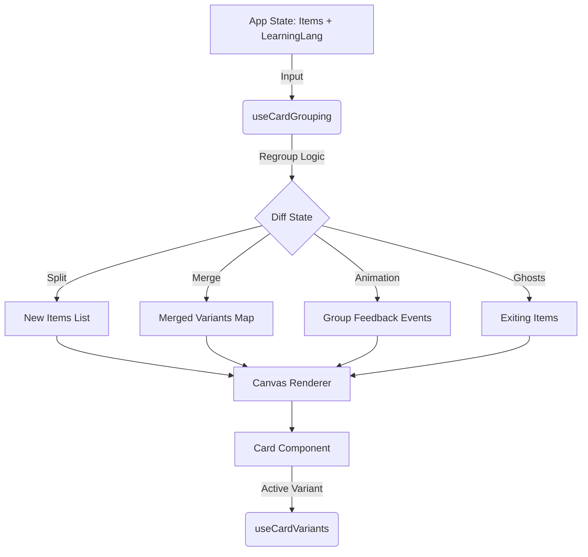

# Lexicoin Merge/Split System

**Current Version**: 3.0 (Comprehensive Architecture)
**Last Updated**: 2026-02-16

## 1. Core Philosophy: The Linguistic Engine

The Merge/Split system is the **active linguistic engine** of Lexicoin. It solves the fundamental problem of vocabulary mapping across languages: **One word does not equal one concept.**

### The Problem: Asymmetric Polysemy
-   **Language A (Source)**: A single word represents multiple distinct concepts (Polysemy).
    -   *Example*: English "Spring" -> {Season, Coil, Jump, Water Source}.
-   **Language B (Target)**: These concepts map to completely different words.
    -   *Chinese*: {春天 (Season), 弹簧 (Coil), 跳跃 (Jump), 泉水 (Water Source)}.

### The Solution: Dynamic Regrouping
As the user switches the **Learning Language** (Target Language), the system dynamically reorganizes the abstract concepts (`CardEntity` / `SenseEntity`) based on their **Lexical Form** (the written word) in that target language.

1.  **Merge**: When multiple distinct Senses share the same word in the target language (e.g., both "Season" and "Coil" become "Spring"), they collapse into a single **Anchor Card**.
2.  **Split**: When the target language changes and those Senses map to different words (e.g., "Season" becomes "春天" and "Coil" becomes "弹簧"), the group dissolves, and the Senses become independent cards again.

---

## 2. Architecture Overview

The system is composed of three distinct layers:
1.  **Orchestrator (`useCardGrouping.ts`)**: The "Brain" that calculates groups and detects changes.
2.  **State Manager (`useCardVariants.ts`)**: The "Memory" that manages the internal state of merged groups.
3.  **Visual Layer (`Card.tsx`, `App.tsx`)**: The "View" that renders the results and animates transitions.



---

## 3. The Orchestrator: `useCardGrouping`

**Location**: `src/app/hooks/useCardGrouping.ts`

This hook is the central processing unit. It runs whenever the `learningLanguage` changes or the total number of items changes.

### 3.1 The Algorithm
1.  **Flatten**: It takes all current items (Anchors) and their hidden variants and flattens them into a single list of `CardEntity` objects.
2.  **Regroup**: It buckets these entities based on their `word` in the *new* `learningLanguage`.
    -   *Normalization*: Words are lowercased to ensure case-insensitive grouping.
    -   *Fallback*: If a word is missing for the target language, the UID is used as a unique key (no merging).
3.  **Sort & Anchor Selection**:
    -   Inside each bucket, cards are sorted by **Frequency** (High -> Low).
    -   The highest frequency card becomes the **Anchor** (the visible face).
    -   The remaining cards become **Variants** (hidden inside the Anchor).
    -   *Stability*: If frequencies are equal, UID comparison is used as a tie-breaker to prevent jitter.

### 3.2 Change Detection & Physics
The system compares the new groups against the previous state (`prevMergedVariants`) to determine how to position the resulting cards.

#### **Split Handling (Cell Division)**
When a card splits (e.g., "Spring" -> "春天" + "弹簧"):
1.  **Anchor Identification**: The system finds the "Old Anchor" that contained these cards.
2.  **Location Inheritance**: All resulting cards inherit the location (Canvas vs. Repository) and position (X, Y) of the Old Anchor.
3.  **Physics Offset**: To prevent perfect overlap (which breaks physics engines), a small random offset (`+/- 5px`) is applied. The generic `usePhysics` hook then naturally pushes them apart, creating a "cell division" effect.

#### **Merge Handling (Absorption)**
When cards merge (e.g., "春天" + "弹簧" -> "Spring"):
1.  **Target Identification**: The system identifies the new Anchor for the group.
2.  **Ghost Creation (`ExitingItems`)**:
    -   Cards that are no longer Anchors but were visible are added to `exitingItems`.
    -   These "Ghost" cards are rendered purely for animation.
    -   **Animation**: They translate from their old position to the new Anchor's position while scaling down to `0.1`.
    -   **Animation**: They translate from their old position to the new Anchor's position while scaling down to `0.1`.
    -   **Cleanup**: After ~600ms, they are removed from the DOM.

#### **Animation Conditions & Edge Cases**
The system applies specific logic to prevent visual clutter during merges:
-   **Canvas -> Canvas**: Standard animation. The ghost card flies to the new Anchor's position.
-   **Canvas -> Repository**: If the target Anchor is in the Dock, the ghost card animates to the **Dock Center** (with a random spread of `+/- 250px` to create a "pile up" effect).
-   **Repository -> Repository**: **No Animation**. If both cards are already in the dock, the merge happens instantly/silently to avoid confusing motion inside the collapsed UI.

### 3.3 Feedback Events
The hook emits `groupFeedback` events:
-   `merge: string[]` (UIDs of Anchors that just absorbed a card)
-   `split: string[]` (UIDs of cards that just split from a group)
-   `timestamp`: Processed by `Card.tsx` to trigger one-shot visual effects (glows/flashes).

---

## 4. The State Manager: `useCardVariants`

**Location**: `src/app/hooks/useCardVariants.ts`

This hook runs inside each `Card` component that has variants. It manages *which* specific sense is currently displayed on the card face.

### 4.1 Active Variant Persistence
-   **Store**: Uses `useGameStore` (`activeVariants` slice) to persist the user's selection.
-   **Logic**:
    -   By default, the Anchor (highest frequency) is shown.
    -   If the user manually selects a variant, that selection is saved by the Anchor's UID.
    -   *Result*: If you flip "Spring" to mean "Coil", it remembers that choice even if you drag the card around or reload.

### 4.2 Sorting & Display
-   **Sorted Variants**: Combines the Anchor + Variants and sorts them by frequency. This list is used for the **Selection Overlay**.
-   **Current Data**: Determines the `learningData` and `systemData` to pass to the `CardVisual`. This ensures the card displays the *correct definition and POS* for the selected variant, not just the Anchor's default.

---

## 5. Visual Layer Integration

**Location**: `src/app/components/ui/Card.tsx` & `App.tsx`

### 5.1 App Integration
`App.tsx` initializes `useCardGrouping` and distributes the data:
-   **Rendering**: It maps over `data.canvasItems` (the Anchors).
-   **Props**: It passes `variants={grouping.mergedVariants[item.uid]}` to each card.
-   **Ghosts**: It renders `grouping.exitingItems` as independent `Card` components with `externalScale` logic to handle the shrink animation.

### 5.2 Card Component Logic
-   **Visual Feedback**: Listens to `groupFeedback`.
    -   If `merge` event detected: Sets `visualFeedback = 'merge'` -> Triggers Cyan/White glow.
    -   If `split` event detected: Sets `visualFeedback = 'split'` -> Triggers Gold "Containment Field" rupture effect.
-   **Selection Overlay**:
    -   Triggered by clicking the Definition area.
    -   Displays the list of `sortedVariants`.
    -   Allows the user to manually switch the active sense (e.g., force "Spring" to show the "Coil" definition).

### 5.3 Visual Metaphor (The "Coating") (Default Persona)
-   **Merge (Conjunction)**:
    -   **Symbol**: The Conjunction Rune (Two intersecting circles).
    -   **Effect**: White/Cyan glow, representing purification/synthesis.
-   **Split (Separation)**:
    -   **Symbol**: The Cracked Core (A solid sphere fractured in half).
    -   **Effect**: Gold radiated glow, dashed "field" lines, representing the release of energy.

---

## 6. Key Data Structures

### `CardItem` (App Layer)
The wrapper used by the Canvas/Deck:
```typescript
interface CardItem {
    cardData: CardEntity; // The "Anchor" sense
    mx: MotionValue<number>; // X Position
    my: MotionValue<number>; // Y Position
    location: 'canvas' | 'repository'; // Where it is
    // ... dimensions, etc.
}
```

### `mergedVariants` (Grouping Output)
The map of hidden cards:
```typescript
// Key: UID of the Anchor Card
// Value: List of cards merged INTO that anchor
Record<string, CardEntity[]>
```

### `groupFeedback` (Event Bus)
The signal for visual effects:
```typescript
{
    merge: string[]; // UIDs of Anchors that grew
    split: string[]; // UIDs of Cards that were born
    timestamp: number;
}
```
