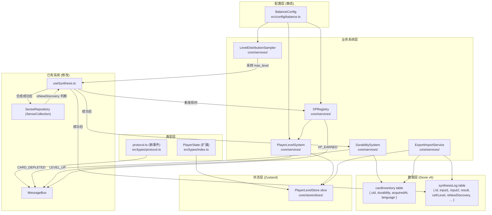

# 游戏基础设施 — 技术设计文档 (TDD)

> **Version**: 1.1 · **Date**: 2026-03-29 · **Project**: Lexicoin
> **范围**：XP 体系、玩家等级（per-language）、合成难度分布、卡牌耐久度、合成日志、导出/导入
>
> **v1.1 变更**：废除全局 `player.level`，改为 `languageProgress[lang].level`；废除 `cefrUnlocked`；isNewDiscovery 改为本地 SenseCollection 查询；LevelDistributionSampler 只接受 `languageLevel`；合成失败不扣耐久；重复合成定义修正为 cardInventory 持有判断；cardInventory 清理规则；移除 `isGlobalFirst`。

---

## 1. 架构概览

### 1.1 新增组件图



### 1.2 核心序列图：合成触发链

```
useSynthesis.synthesize()
  │
  ├─ [前] LevelDistributionSampler.sampleMaxLevel(languageLevel)
  │         └─ 返回本次 max_level，传入 Edge Function
  │
  ├─ 合成失败 → 流程终止，无任何副作用
  │
  └─ 合成成功，得到 resultUid
       │
       ├─ [1] senseRepository.exists(resultUid)  →  判断 isNewDiscovery
       │
       ├─ [2] DurabilitySystem.deductOnSynthesis(input1Uid, input2Uid)
       │       ├─ 写 cardInventory（扣耐久）
       │       └─ 耐久归零 → CARD_DEPLETED → Canvas 移除
       │
       ├─ [3] synthesisLogRepository.write({ ..., isNewDiscovery })
       │
       └─ [4a] isNewDiscovery = true
               ├─ senseRepository.save(senseEntity)   → 写 SenseCollection
               ├─ cardInventory.upsert({ uid: resultUid, durability: 100, ... })
               ├─ xpRegistry.award('SENSE_COLLECTED', { cefrLevel: max_level, language })
               └─ playerLevelSystem.checkLevelUp(language)

           [4b] isNewDiscovery = false, resultUid 在 cardInventory 中（重复持有）
               └─ DurabilitySystem.restoreOnDuplicate(resultUid)

           [4c] isNewDiscovery = false, resultUid 不在 cardInventory（曾有已失去）
               └─ cardInventory.upsert({ uid: resultUid, durability: 100, ... })
```

---

## 2. 数据模型

### 2.1 PlayerState 扩展

**文件**：`src/types/index.ts`

**删除**：`PlayerState.level`、`PlayerState.xp`、`PlayerState.xpToNextLevel`（全局字段废除）

**新增 / 替换**：

```typescript
export interface LanguageProgress {
    /** 该语言的玩家等级（1–100），是合成难度分布的输入参数 */
    level: number;
    /** 当前等级已积累的 XP */
    xp: number;
    /** 升到下一级所需的总 XP */
    xpToNextLevel: number;
    /** 该语言下已发现的不重复 Sense 数量（统计用） */
    sensesCollected: number;
    /** 首次在该语言下合成的时间戳 */
    startedAt: Timestamp;
}

export interface StreakData {
    current: number;        // 当前连续天数
    best: number;           // 历史最高
    lastPlayDate: string;   // 'YYYY-MM-DD'
}

// PlayerState 中追加（替换原来的 level/xp/xpToNextLevel）：
// languageProgress: Partial<Record<Language, LanguageProgress>>;
// streak: StreakData;
```

`initialPlayer` 中对应初始值：
```typescript
languageProgress: {},
streak: { current: 0, best: 0, lastPlayDate: '' },
```

---

### 2.2 CardInventory（新 Dexie 表）

**语义**：玩家当前**实际持有**的卡牌库存（画布或仓库中存在的卡）。

```typescript
// src/core/storage/db.ts
export interface CardInventoryRecord {
    uid: string;            // PK，对应 SenseEntity.uid
    durability: number;     // 0–100（归零时删除记录）
    acquiredAt: number;     // 首次获得时间戳
    language: Language;     // 来自哪个 learningLang 的合成
}
```

**清理规则**：以下场景必须删除对应记录：
- 耐久归零
- 玩家主动从画布移除（且未放入仓库）
- 玩家从仓库丢弃
- 魔典槽消耗（预留）

---

### 2.3 SynthesisLog（新 Dexie 表）

```typescript
export interface SynthesisLogRecord {
    id: string;                 // UUID，PK
    input1Uid: string;
    input2Uid: string;
    resultUid: string;
    language: Language;         // 合成时的 learningLang
    cefrLevel: CEFRLevel;       // 本次合成的 max_level
    isNewDiscovery: boolean;    // 合成前本地 SenseCollection 是否无此词
    timestamp: number;          // Unix ms
}
```

> `isGlobalFirst` 字段已移除。

---

### 2.4 BalanceConfig（新配置文件）

**文件**：`src/config/balance.ts`

```typescript
// ── CEFR ──────────────────────────────────────────────────────────────
export const CEFR_LEVELS = ['A1', 'A2', 'B1', 'B2', 'C1', 'C2'] as const;
export type CEFRLevel = typeof CEFR_LEVELS[number];

// ── 玩家等级上限 ──────────────────────────────────────────────────────
export const MAX_LANGUAGE_LEVEL = 100;

// ── 升级 XP 阈值表（index = level - 1，共 100 条）─────────────────────
export const LEVEL_XP_THRESHOLDS: number[] = [
    /* 待填写 100 条 */
];

// ── 每个语言等级的 CEFR 合成概率分布 ─────────────────────────────────
export type CEFRDistribution = Partial<Record<CEFRLevel, number>>;
export const LEVEL_CEFR_DISTRIBUTION: Record<number, CEFRDistribution> = {
    1:  { A1: 1.0 },
    10: { A1: 0.60, A2: 0.30, B1: 0.10 },
    /* 待填写完整 100 行 */
};

// ── CEFR 难度 XP 系数 ─────────────────────────────────────────────────
export const CEFR_XP_COEFFICIENT: Record<CEFRLevel, number> = {
    A1: 1.0, A2: 1.5, B1: 2.0, B2: 2.5, C1: 3.5, C2: 5.0,
};

// ── XP 基础值 ─────────────────────────────────────────────────────────
export const XP_SENSE_BASE = 10; // 待调整

// ── 耐久度配置 ────────────────────────────────────────────────────────
export const DURABILITY_INITIAL = 100;
export const DURABILITY_SYNTHESIS_COST = 10;    // 待调整
export const DURABILITY_DUPLICATE_RESTORE = 30; // 待调整
```

---

### 2.5 Dexie DB 升级：v6

**文件**：`src/core/storage/db.ts`

```typescript
db.version(6).stores({
    gameData:        'key',
    canvasPositions: 'uid, location',
    senses:          'uid',
    visuals:         '[uid+variantId], uid',
    devices:         'uid, location',
    cardInventory:   'uid, language',                          // 新增
    synthesisLog:    'id, resultUid, language, timestamp',     // 新增
});
```

---

## 3. 核心系统设计

### 3.1 LevelDistributionSampler

**文件**：`src/core/services/LevelDistributionSampler.ts`

**签名**（v1.1 修正，移除 cefrUnlocked 参数）：

```typescript
/**
 * 根据玩家在当前语言下的等级，采样本次合成的 max_level。
 * 无 cefrUnlocked 上限——CEFR 概率完全由等级的分布表决定。
 */
export function sampleMaxLevel(languageLevel: number): CEFRLevel {
    const dist = LEVEL_CEFR_DISTRIBUTION[languageLevel] ?? { A1: 1.0 };

    const rand = Math.random();
    let cumulative = 0;
    for (const [level, prob] of Object.entries(dist)) {
        cumulative += prob as number;
        if (rand <= cumulative) return level as CEFRLevel;
    }
    return 'A1'; // 安全保底
}
```

**调用方式**：
```typescript
const languageLevel = store.getState().languageProgress[learningLang]?.level ?? 1;
const max_level = sampleMaxLevel(languageLevel);
```

---

### 3.2 XPRegistry

**文件**：`src/core/services/XPRegistry.ts`

```typescript
export type XPSourceId = 'SENSE_COLLECTED' | string;

export interface XPAwardContext {
    cefrLevel: CEFRLevel;
    language: Language;
    [key: string]: any;
}

export interface XPSourceDef {
    id: XPSourceId;
    label: string;
    computeAmount: (context: XPAwardContext) => number;
}

class XPRegistry {
    private sources = new Map<XPSourceId, XPSourceDef>();

    register(source: XPSourceDef): void;

    /**
     * 发放 XP：
     * 1. computeAmount(context)
     * 2. 更新 languageProgress[language].xp（via Zustand）
     * 3. publish XP_EARNED
     * 4. 调用 playerLevelSystem.checkLevelUp(language)
     */
    async award(sourceId: XPSourceId, context: XPAwardContext): Promise<void>;
}

export const xpRegistry = new XPRegistry();

// 初始注册
xpRegistry.register({
    id: 'SENSE_COLLECTED',
    label: '收集新 Sense',
    computeAmount: ({ cefrLevel }) =>
        XP_SENSE_BASE * CEFR_XP_COEFFICIENT[cefrLevel],
});
```

---

### 3.3 PlayerLevelSystem

**文件**：`src/core/services/PlayerLevelSystem.ts`

```typescript
class PlayerLevelSystem {
    /**
     * 在某语言 XP 变化后调用
     * - 读取 languageProgress[language].xp 和 level
     * - 对比 LEVEL_XP_THRESHOLDS[level - 1]
     * - 满足 → level += 1，xp 减去阈值，更新 xpToNextLevel
     * - publish LEVEL_UP { language, newLevel, previousLevel }
     */
    checkLevelUp(language: Language): void;

    /**
     * 初始化某语言的进度条目（首次合成时调用）
     */
    initLanguage(language: Language): void;
}

export const playerLevelSystem = new PlayerLevelSystem();
```

---

### 3.4 DurabilitySystem

**文件**：`src/core/services/DurabilitySystem.ts`

```typescript
class DurabilitySystem {
    /**
     * 合成成功后扣耐久（仅在合成成功时调用，失败不调用）
     * - 扣减 DURABILITY_SYNTHESIS_COST
     * - 耐久 <= 0 → 删除 cardInventory 记录 → publish CARD_DEPLETED
     * - 否则 → 更新耐久 → publish CARD_DURABILITY_CHANGED
     */
    async deductOnSynthesis(input1Uid: string, input2Uid: string): Promise<void>;

    /**
     * 重复合成（resultUid 已在 cardInventory 中）
     * - durability += DURABILITY_DUPLICATE_RESTORE（上限 100）
     * - publish CARD_DURABILITY_CHANGED
     */
    async restoreOnDuplicate(uid: string): Promise<void>;

    /**
     * 主动移除卡牌（从画布或仓库）
     * - 删除 cardInventory 记录
     * - publish CARD_DEPLETED（用于 Canvas 清理）
     */
    async removeCard(uid: string): Promise<void>;

    /**
     * 魔典槽消耗（预留，本次不调用）
     * - 删除 cardInventory 记录
     * - publish CARD_DEPLETED
     */
    async depleteForGrimoire(uid: string): Promise<void>;
}

export const durabilitySystem = new DurabilitySystem();
```

---

### 3.5 ExportImportService

**文件**：`src/core/services/ExportImportService.ts`

```typescript
export interface ExportBundle {
    schemaVersion: 1;
    exportedAt: number;
    playerProfile: PlayerState;
    senses: SenseRecord[];
    visuals: VisualRecord[];
    cardInventory: CardInventoryRecord[];
    synthesisLog: SynthesisLogRecord[];
    canvasPositions: CanvasPositionRecord[];
    devices: DeviceRecord[];
}

export interface ImportResult {
    success: boolean;
    sensesImported: number;
    synthesisLogsImported: number;
    error?: string;
}

class ExportImportService {
    /** 读取所有 Dexie 表 + Zustand PlayerState，序列化为 JSON，触发浏览器下载 */
    async exportToFile(): Promise<void>;

    /**
     * 从 JSON 文件导入（完全覆盖）
     * - 校验 schemaVersion
     * - 清空所有 Dexie 表
     * - 全量写入
     * - 更新 Zustand store（PlayerState）
     */
    async importFromFile(file: File): Promise<ImportResult>;
}

export const exportImportService = new ExportImportService();
```

---

## 4. 事件协议扩展

**文件**：`src/types/protocol.ts`

新增事件类型（加入 `AppMessage` union）：

```typescript
export interface XPEarnedMessage extends BaseMessage<{
    source: string;         // XPSourceId
    amount: number;
    totalXp: number;
    language: Language;     // 归属语言
}> { type: 'XP_EARNED'; }

export interface LevelUpMessage extends BaseMessage<{
    language: Language;     // 哪个语言等级升了
    newLevel: number;
    previousLevel: number;
}> { type: 'LEVEL_UP'; }

export interface CardDurabilityChangedMessage extends BaseMessage<{
    uid: string;
    delta: number;          // 负数为扣耐久，正数为恢复
    newDurability: number;
}> { type: 'CARD_DURABILITY_CHANGED'; }

export interface CardDepletedMessage extends BaseMessage<{
    uid: string;
}> { type: 'CARD_DEPLETED'; }
```

预留声明（不加入 union，标注 `// RESERVED`）：

```typescript
// RESERVED
export interface AchievementUnlockedMessage extends BaseMessage<{
    achievementId: string;
    label: string;
}> { type: 'ACHIEVEMENT_UNLOCKED'; }

// RESERVED
export interface StreakUpdatedMessage extends BaseMessage<{
    current: number;
    best: number;
}> { type: 'STREAK_UPDATED'; }

// RESERVED
export interface GrimoireGeneratedMessage extends BaseMessage<{
    grimoireId: string;
    theme: string;
    slotCount: number;
}> { type: 'GRIMOIRE_GENERATED'; }

// RESERVED
export interface GrimoireSlotFilledMessage extends BaseMessage<{
    grimoireId: string;
    slotId: string;
    result: 'success' | 'fail';
    feedback?: string;
}> { type: 'GRIMOIRE_SLOT_FILLED'; }

// RESERVED
export interface GrimoireCompletedMessage extends BaseMessage<{
    grimoireId: string;
    score: number;
}> { type: 'GRIMOIRE_COMPLETED'; }
```

---

## 5. useSynthesis 集成

**文件**：`src/app/hooks/useSynthesis.ts`（确认实际路径）

插入点和完整逻辑：

```typescript
async function synthesize(input1Uid, input2Uid, lang, ...) {

    // ① 采样本次 max_level
    const languageLevel = store.getState().languageProgress[lang]?.level ?? 1;
    const max_level = sampleMaxLevel(languageLevel);

    // ② 调用 Edge Function
    const result = await supabase.functions.invoke('synthesize-sense', {
        body: { ..., max_level }
    });

    // ③ 合成失败 → 直接返回，不执行任何后续操作
    if (!result.success) return;

    const { senseEntity } = result;
    const resultUid = senseEntity.uid;

    // ④ 判断 isNewDiscovery（本地查询，不依赖 API 字段）
    const isNewDiscovery = !(await senseRepository.exists(resultUid));

    // ⑤ 输入卡耐久扣减（仅在成功时）
    await durabilitySystem.deductOnSynthesis(input1Uid, input2Uid);

    // ⑥ 写合成日志
    await synthesisLogRepository.write({
        input1Uid, input2Uid, resultUid,
        language: lang,
        cefrLevel: max_level,
        isNewDiscovery,
    });

    // ⑦ 根据 isNewDiscovery 分支处理
    const isCurrentlyHeld = await cardInventoryRepository.exists(resultUid);

    if (isNewDiscovery) {
        // 新发现：写 SenseCollection，创建 cardInventory，发 XP
        await senseRepository.save(senseEntity);
        await cardInventoryRepository.upsert({
            uid: resultUid, durability: DURABILITY_INITIAL,
            acquiredAt: Date.now(), language: lang,
        });
        await xpRegistry.award('SENSE_COLLECTED', { cefrLevel: max_level, language: lang });
        playerLevelSystem.checkLevelUp(lang);

    } else if (isCurrentlyHeld) {
        // 重复持有：恢复耐久
        await durabilitySystem.restoreOnDuplicate(resultUid);

    } else {
        // 曾有已失去：创建新卡，不发 XP
        await cardInventoryRepository.upsert({
            uid: resultUid, durability: DURABILITY_INITIAL,
            acquiredAt: Date.now(), language: lang,
        });
    }
}
```

---

## 6. 文件影响清单

| 文件 | 操作 | 说明 |
|------|------|------|
| `src/config/balance.ts` | **新建** | 所有数值配置，含 CEFRLevel 类型 |
| `src/types/index.ts` | **修改** | 删除全局 level/xp/xpToNextLevel，新增 LanguageProgress / StreakData，扩展 PlayerState |
| `src/types/protocol.ts` | **修改** | 新增 4 个事件类型 + 5 个 RESERVED 声明 |
| `src/core/storage/db.ts` | **修改** | v6，新增 cardInventory / synthesisLog 表定义 |
| `src/core/services/LevelDistributionSampler.ts` | **新建** | sampleMaxLevel(languageLevel) |
| `src/core/services/XPRegistry.ts` | **新建** | 可扩展 XP 来源注册表 |
| `src/core/services/PlayerLevelSystem.ts` | **新建** | per-language 升级检测 |
| `src/core/services/DurabilitySystem.ts` | **新建** | 耐久度全部变更入口 |
| `src/core/services/ExportImportService.ts` | **新建** | 导出/导入 |
| `src/core/storage/SynthesisLogRepository.ts` | **新建** | synthesisLog CRUD |
| `src/core/storage/CardInventoryRepository.ts` | **新建** | cardInventory CRUD（含 exists / delete） |
| `src/core/store/slices/createPlayerLevelSlice.ts` | **新建** | languageProgress 相关 store actions |
| `src/core/store/interfaces.ts` | **修改** | 新增 PlayerLevelSlice 接口，更新 GameStore |
| `src/core/store/index.ts` | **修改** | initialPlayer 更新（删 level/xp，加 languageProgress/streak） |
| `src/app/hooks/useSynthesis.ts` | **修改** | 接入全部新系统 |
