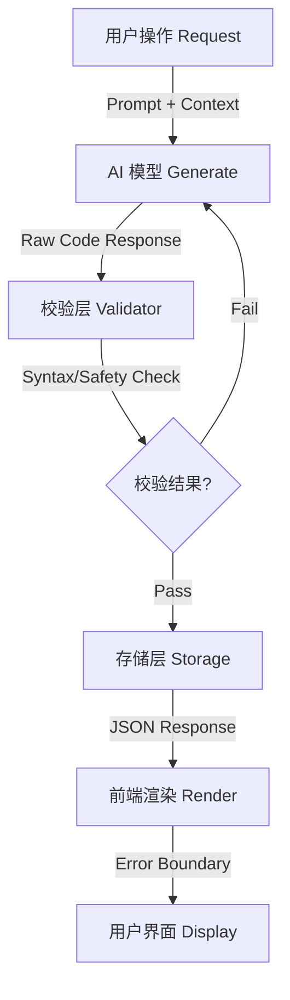

# Lexicoin Generative UI (GenUI) 架构流程说明

> ⚠️ 状态: 描述旧合同(2026-07-05 标注)。"GenUI"名称已废弃,系统更名 **Totem 管线**,视觉资产合同已改为"分层 SVG + 动画清单"(见 [decisions/ADR-009](decisions/ADR-009-totem-asset-contract.md))。本文描述的 TSX 可执行代码方案仍是迁移前的现行实现;**注意:本文"校验层/安全扫描"章节描述的是设计愿景,实际代码从未实现这些防线**(2026-07-05 实勘)。迁移完成后本文归档。

本文档基于业界成熟的 GenUI (Generative User Interface) 实践方案，结合 Lexicoin 项目的具体情况（React + TypeScript + Framer Motion），梳理了 AI 生成 UI 的标准处理流程。

该流程旨在解决由 AI 直接生成不可控代码导致的常见问题（如语法错误、构建失败、运行时崩溃等），确保系统的健壮性。

## 1. 核心流程概览 (Core Pipeline)

整个 GenUI 管道分为 5 个关键阶段：



---

## 2. 详细阶段说明

### 阶段 1：请求构建 (Request Construction)
前端根据用户当前的上下文（如正在交互的元素、历史操作），向 AI 发送结构化的 Prompt。

*   **输入**: 用户意图 + 当前状态上下文。
*   **Prompt 策略**: 明确要求 AI 输出这一层必须是一个纯函数组件 (Pure Functional Component)，并显式列出可用的库（如 `framer-motion`）。避免 AI 幻觉引入不存在的 API。

### 阶段 2：AI 生成 (AI Generation)
AI 模型生成包含 React 组件代码的响应。

*   **输出格式**: 建议要求 AI 返回 JSON 格式，其中代码作为字符串字段，例如：
    ```json
    {
      "componentName": "FireCardVisual",
      "code": "import React from 'react'; ..."
    }
    ```
    *   **优势**: JSON 标准会强制处理特殊字符转义（如换行符 `\n`，双引号 `\"`），这是解决我们遇到的 `Unterminated string literal` 问题的最直接方法。

### 阶段 3：校验与消毒 (Validator & Sanitizer) —— **关键防线**
这是目前工业界最重视的一个环节。AI 生成的代码不能直接入库，必须经过校验。

*   **语法检查 (Syntax Check)**: 使用解析器（如 Babel Parser 或 TypeScript Compiler API）尝试解析代码，如果解析失败（语法错误），则拒绝该次生成，触发重试。
*   **安全扫描 (Security Scan)**: 检查代码中是否包含危险操作（如 `eval`, `window.location`, 外部网络请求 `fetch` 等）。GenUI 组件通常应该是纯展示性的。
*   **依赖白名单**: 确保代码只 import 了项目中已安装的库。

### 阶段 4：存储与序列化 (Storage & Serialization)
经过校验的安全代码存入数据库。

*   **存储格式**: 
    *   **推荐**: 存储为 JSON 字符串或纯文本文件。数据库字段类型建议为 `TEXT` 或 `JSONB`。
    *   **避免**: 避免像之前我们做的那样，把代码硬编码拼接到 `.ts` 源码文件中。这会导致构建时的语法错误风险，且难以维护。
*   **版本控制**: 建议对生成的 UI 组件进行版本管理，以便回滚。

### 阶段 5：前端渲染 (Frontend Rendering)
前端获取代码字符串并在浏览器中运行。

*   **沙箱环境 (Sandboxing)**: 不要直接用 `eval`。推荐使用专门的沙箱执行环境，如：
    *   `Sandpack` (CodeSandbox 出品)
    *   自定义 `RemoteComponent` 加载器 (基于 iframe 或 Shadow DOM)
*   **错误边界 (Error Boundary)**:
    *   **必须实现**。即使代码语法正确，逻辑运行时也可能报错（如 `undefined is not a function`）。
    *   使用 React 的 `<ErrorBoundary>` 包裹每一个 AI 生成的组件。如果组件崩溃，显示一个优雅的“数据损坏”或“加载失败”占位图，而不是导致整个应用白屏。

---

## 3. 本项目痛点解决方案 (Specific Solutions for Lexicoin)

针对 Lexicoin 开发过程中遇到的具体问题（如 `Unterminated string literal`），我们采取以下针对性策略：

### 问题：字符串字面量未终结 (Unterminated String Literal)
**原因**: 直接将 AI 生成的多行代码文本，用双引号 `"` 包裹赋值给 TypeScript 变量，导致换行符破坏了字符串结构。
**解决方案**:
1.  **转义策略**: 在生成脚本中，对 AI 返回的代码文本进行转义处理（Escape）。将换行符替换为 `\n`，将双引号替换为 `\"`。
2.  **模板字面量**: 如果手动编写/修改数据文件，**必须**使用反引号 (\`\`) 包裹多行代码，并注意转义内部的 `${}` 插值符号。

### 问题：组件样式冲突
**原因**: AI 生成的组件可能会带有一些全局样式，污染主应用。
**解决方案**:
1.  **Scoped CSS**: 要求 AI 使用 Tailwind CSS 或 CSS Modules。
2.  **Shadow DOM**: 在渲染层使用 Shadow DOM 隔离样式。

---

## 4. 最佳实践总结 (Best Practices)

1.  **Trust but Verify**: 永远不要信任 AI 生成的代码，必须经过校验。
2.  **Fail Gracefully**: 做好由于代码质量差导致渲染失败的准备（Error Boundary）。
3.  **Serialize Correctly**: 代码就是字符串，存储和传输时遵循 JSON 标准进行转义，不要直接拼接源码文件。
