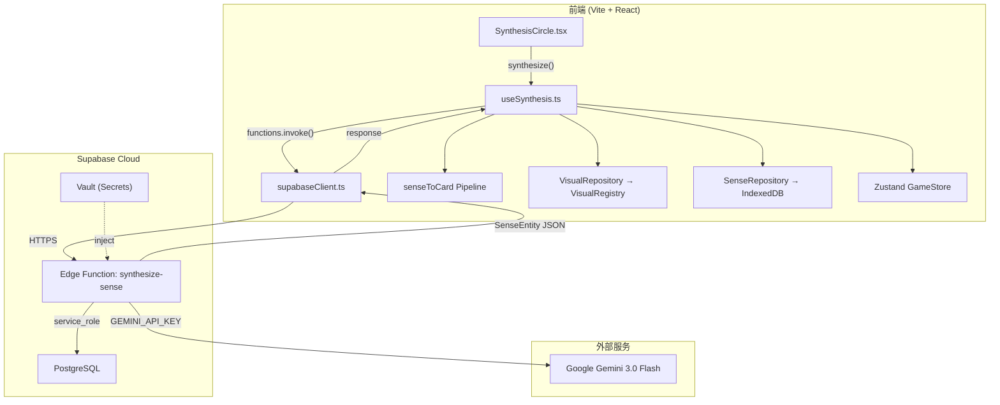
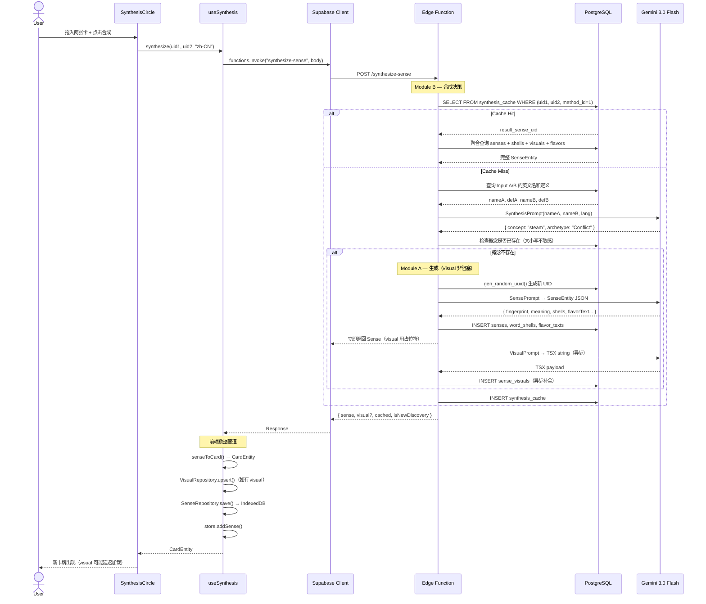
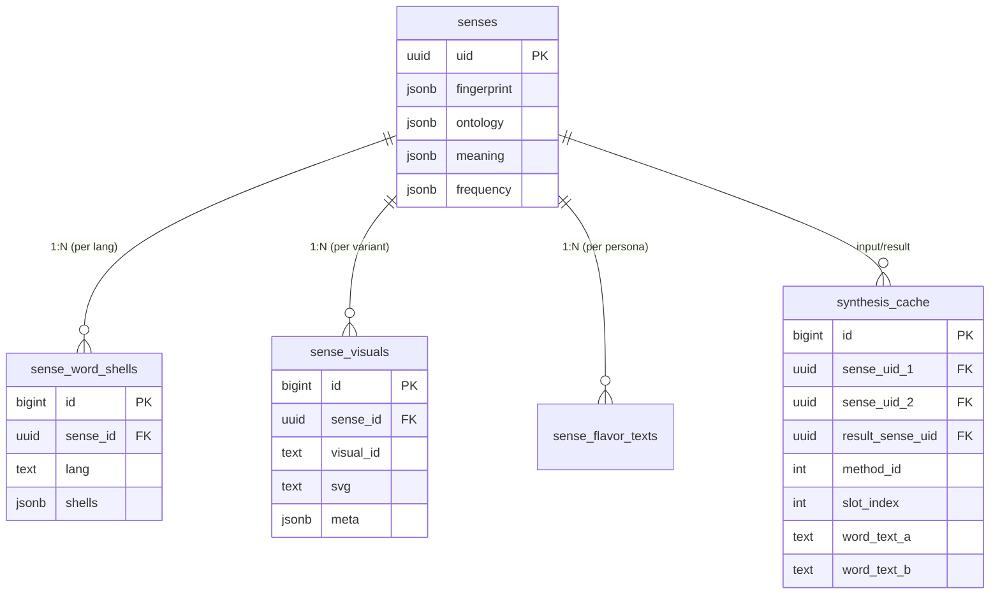
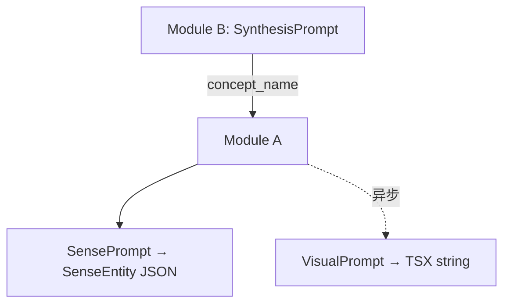
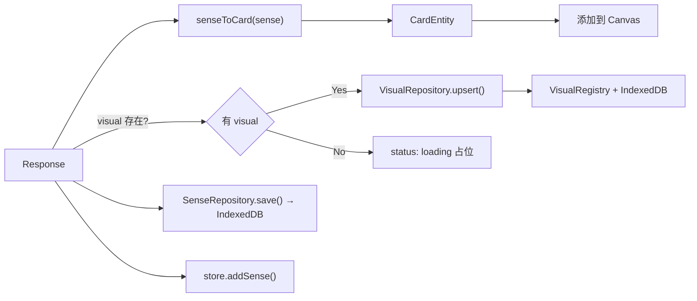

# 合成词语功能 — 技术设计文档 (TDD)

> **Version**: 2.0 · **Date**: 2026-02-18 · **Project**: Lexicoin · **Supabase Project ID**: `leehstoygnmmofpznsvc`

---

## 1. 系统架构

### 1.1 组件总览



### 1.2 核心序列图



---

## 2. 数据库设计

### 2.1 涉及表总览（实际 DB 列名）

| 表名 | 列 | RLS |
|------|-----|-----|
| `senses` | `uid` (uuid PK), `fingerprint` (jsonb), `ontology` (jsonb), `meaning` (jsonb?), `frequency` (jsonb?), `frequency_val` (int?), `search_vector` (tsvector?) | ✅ |
| `sense_word_shells` | `id` (bigint PK), `sense_id` (uuid FK), `lang` (text), `shells` (jsonb) | ✅ |
| `sense_visuals` | `id` (bigint PK), `sense_id` (uuid FK), `visual_id` (text), `svg` (text), `meta` (jsonb) | ✅ |
| `sense_flavor_texts` | `id` (bigint PK), `sense_id` (uuid FK), `persona` (text), `translations` (jsonb), `global_meta` (jsonb) | ✅ |
| `synthesis_cache` | `id` (bigint PK), `sense_uid_1/2` (uuid FK), `result_sense_uid` (uuid FK), `method_id` (int 1-6), `slot_index` (int, 目前=1), `word_text_a/b` (text), `lang` (text?), `meta` (jsonb) | ✅ |

### 2.2 synthesis_cache UNIQUE 约束（实际状态）

```sql
-- 唯一约束（4列复合）
UNIQUE INDEX (sense_uid_1, sense_uid_2, method_id, slot_index)

-- method_id: 使用的合成原型（1-6）
-- slot_index: 预留多结果位，目前恒等于 1
```

| method_id | Archetype | 描述 |
|-----------|-----------|------|
| 1 | Composition | 材料/实体组合 |
| 2 | Metaphor | 抽象隐喻映射 |
| 3 | Conflict | 碰撞产物 |
| 4 | Function | 工具-目的关系 |
| 5 | Gestalt | 共存情境 |
| 6 | Other | LLM 自选 |

### 2.3 DB 列名 → schema.ts 映射

| DB 列 | SenseEntity.schema.ts | 说明 |
|--------|----------------------|------|
| `sense_visuals.svg` | `VisualEntry.payload` | TSX 字符串存储列 |
| `sense_visuals.visual_id` | `VisualEntry.id` | 变体ID（"default"） |
| `sense_visuals.sense_id` | `VisualEntry.uid` | FK 引用 senses.uid |
| `sense_word_shells.shells` | `WordShell[]` JSON | 该语言的所有 shells 打包 |
| `sense_flavor_texts.translations` | `{ text, example }` per lang | 多语言文本打包 |
| `sense_flavor_texts.global_meta` | `FlavorTextEntry.meta` | 全局元数据 |

### 2.4 Edge Function 查询英文名和定义

```sql
-- 获取 Sense 的英文名
SELECT shells->>0 AS first_shell
FROM sense_word_shells
WHERE sense_id = $uid AND lang = 'en';
-- 从 first_shell JSON 中提取 text.value

-- 获取英文定义
SELECT meaning->'en'->>'value' AS def_en FROM senses WHERE uid = $uid;
```

### 2.5 ER 关系图



---

## 3. API 接口定义

### 3.1 Edge Function: `synthesize-sense`

**Endpoint**: `POST https://leehstoygnmmofpznsvc.supabase.co/functions/v1/synthesize-sense`

#### Request

```typescript
interface SynthesisRequest {
  input_1_id: string;   // UUID
  input_2_id: string;   // UUID
  lang: string;         // e.g. "zh-CN" — 影响数据来源语言和 prompt 文化透镜
  max_level?: string;   // CEFR 上限, 默认 "B2"
}
```

#### Response — Success (HTTP 200)

```typescript
interface SynthesisSuccessResponse {
  success: true;
  data: {
    sense: SenseEntityPayload;  // 完整数据（不含 qualia）
    visual: VisualPayload | null; // 如果是新生成且 visual 异步中则为 null
    cached: boolean;
    isNewDiscovery: boolean;
    archetypeUsed: string;      // "Composition" | "Metaphor" | etc.
  }
}

interface SenseEntityPayload {
  uid: string;     // 后端 gen_random_uuid() 生成
  fingerprint: { items: { word: string; tier: 1|2|3 }[] };
  ontology: { value: string; meta: { stability: number } };
  frequency: { value: number; meta: { stability: number } };
  meaning: Record<string, { value: string; meta: EntryMetadata }>;
  shells: Record<string, WordShellPayload[]>;
  flavorText: FlavorTextPayload[];
}

interface VisualPayload {
  uid: string;
  id: string;        // "default"
  payload: string;    // TSX 组件字符串
  meta: { stability: number; firstDiscoverer: string; firstDiscoveredAt: number }
}
```

#### Response — Failure (HTTP 200)

```typescript
interface SynthesisFailureResponse {
  success: false;
  error: {
    code: SynthesisErrorCode;
    message: string;
  }
}

type SynthesisErrorCode =
  | 'NO_SYNERGY'       // 两概念无法合成
  | 'OFFENSIVE'         // 结果违反安全规则
  | 'TOO_COMPLEX'       // 超出难度上限
  | 'INPUT_NOT_FOUND'   // UID 不存在
  | 'SAME_INPUT'        // 两个输入相同
  | 'GENERATION_FAILED' // Module A 失败
  | 'LLM_ERROR'         // Gemini 调用失败
```

---

## 4. Prompt 工程设计

### 4.1 调用关系与模型配置



| 参数 | SynthesisPrompt | SensePrompt | VisualPrompt |
|------|----------------|-------------|--------------|
| Model | `gemini-3.0-flash` | `gemini-3.0-flash` | `gemini-3.0-flash` |
| Temperature | 0.7 | 0.4 | 0.6 |
| Response MIME | `application/json` | `application/json` | `text/plain` |
| Max Tokens | 500 | 4000 | 3000 |

### 4.2 `lang` 参数对 Prompt 的影响

| 环节 | `lang` 的效果 |
|------|--------------|
| Module B 输入 | **英文名/定义**始终从 `lang='en'` 获取，概念合成是语言无关的 |
| Module B Cultural Lens | 仅 Metaphor/Gestalt 时启用，切换到 `lang` 对应的文化认知：隐喻和联想受 `lang` 影响 |
| Module A SensePrompt | 输出 `en` + `lang` 两种语言的 meaning/shells/flavorText |
| Module A VisualPrompt | 不受 `lang` 影响（visual 是语言无关的） |

> [!NOTE]
> Prompt 本身始终用英文书写（AI 在英文 prompt 下性能最稳定），但 Cultural Lens 段会指示 AI 以目标语言的文化和思维方式进行联想。输出数据根据 `lang` 包含对应语言的词汇和定义。

### 4.3 UID 生成策略

- **UID 由后端 PostgreSQL 生成**：`gen_random_uuid()`
- AI 模型输出中不包含 UID
- Edge Function 在 SensePrompt 返回后、写入 DB 前生成 UID，注入到 SenseEntity 中

### 4.4 Visual 非阻塞生成

1. Module A 先完成 SensePrompt → 写入 `senses` + `sense_word_shells` + `sense_flavor_texts`
2. **立即返回 Sense 数据给前端**（`visual: null`）
3. 后台继续调用 VisualPrompt → 成功后写入 `sense_visuals`
4. 前端收到 `visual: null` 时，卡牌用 `status: 'loading'` 占位，后续通过轮询或下次请求获取 visual

**好处**：合成成功率从"三次 LLM 全部成功"降低为"两次即可"，用户等待时间缩短约 3-5 秒。

### 4.5 VisualPrompt 安全约束

- 禁止 `useEffect`, `useState`, `useRef` 等 hooks
- 仅允许 `import { motion } from 'motion/react'`
- 必须包含 `export default`
- 字符上限 3000
- 生成失败时不阻塞合成结果

---

## 5. 前端数据管道



**超时 UX**：`useSynthesis` hook 在调用 15 秒后显示"仍在处理中…"提示，同时不取消请求。

---

## 6. 安全策略

| 层级 | 措施 |
|------|------|
| **密钥分离** | Gemini API Key + service_role 仅存于 Edge Function Secrets |
| **前端访问** | anon key 只可 `functions.invoke()`，不可直接操作 DB |
| **输入验证** | UUID 格式、非空、不重复、排序后查缓存 |
| **RLS** | 所有表启用，仅 service_role 可写入 |
| **LLM 安全** | Purity Gate 过滤 NSFW |
| **Visual 安全** | sucrase 沙箱编译，非阻塞不影响合成 |
